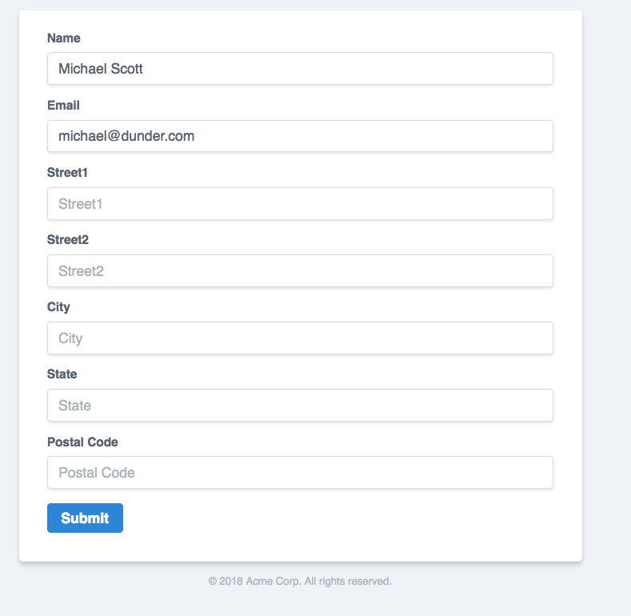
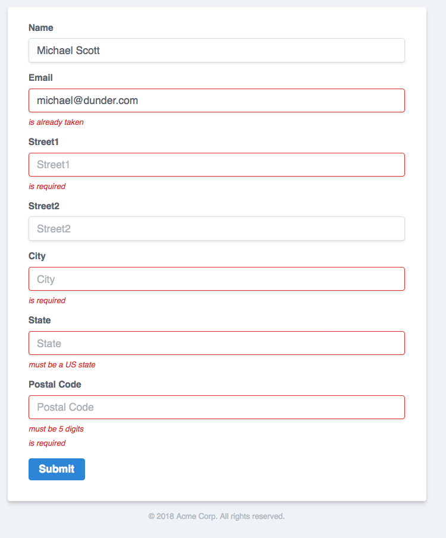

# Form

Easily create HTML forms with Go structs.

[](https://goreportcard.com/report/github.com/joncalhoun/form)
[](https://travis-ci.org/joncalhoun/form)
[](http://opensource.org/licenses/MIT)
[](https://godoc.org/github.com/joncalhoun/form)

## Overview

The `form` package makes it easy to take a Go struct and turn it into an HTML form using whatever HTML format you want. Below is an example, along with the output, but first let's just look at an example of what I mean.

Let's say you have a Go struct that looks like this:

```go
type customer struct {
	Name    string
	Email   string
	Address *address
}

type address struct {
	Street1 string
	Street2 string
	City    string
	State   string
	Zip     string `form:"label=Postal Code"`
}
```

Now you want to generate an HTML form for it, but that is somewhat annoying if you want to persist user-entered values if there is an error, or if you want to support loading URL query params and auto-filling the form for the user. With this package you can very easily do both of those things simply by defining what the HTML for an input field should be:

```html
<div class="mb-4">
	<label class="block text-grey-darker text-sm font-bold mb-2" {{with .ID}}for="{{.}}"{{end}}>
		{{.Label}}
	</label>
	<input class="shadow appearance-none border rounded w-full py-2 px-3 text-grey-darker leading-tight {{if errors}}border-red{{end}}" {{with .ID}}id="{{.}}"{{end}} type="{{.Type}}" name="{{.Name}}" placeholder="{{.Placeholder}}" {{with .Value}}value="{{.}}"{{end}}>
	{{range errors}}
		<p class="text-red pt-2 text-xs italic">{{.}}</p>
	{{end}}
</div>
```

This particular example is using [Tailwind CSS](https://tailwindcss.com/docs/what-is-tailwind/) to style the values, along with the `errors` template function which is provided via this `form` package when it creates the inputs for each field.

Now we can render this entire struct as a form by simply using the `inputs_for` template function which is provided by the `form.Builder`'s `FuncMap` method:

```html
<form class="bg-white shadow-md rounded px-8 pt-6 pb-8 mb-4" action="/" method="post">
  {{inputs_for .Customer}}
  <!-- ... add buttons here -->
</form>
```

And with it we will generate an HTML form like the one below:



Data set in the `.Customer` variable in our template will also be used when rendering the form, which is why you see `Michael Scott` and `michael@dunder.com` in the screenshot - these were set in the `.Customer` and were thus used to set the input's value.

Error rendering is also possible, but requires the usage of the `inputs_and_errors_for` template function, and you need to pass in errors that implement the `fieldError` interface (shown below, but NOT exported):

```go
type fieldError interface {
	FieldError() (field, err string)
}
```

For instance, in [examples/errors/errors.go](examples/errors/errors.go) we pass data similar the following into our template when executing it:

```go
data := struct {
  Form   customer
  Errors []error
}{
  Form: customer{
    Name:    "Michael Scott",
    Email:   "michael@dunder.com",
    Address: nil,
  },
  Errors: []error{
    fieldError{
      Field: "Email",
      Issue: "is already taken",
    },
    fieldError{
      Field: "Address.Street1",
      Issue: "is required",
    },
    ...
  },
}
tpl.Execute(w, data)
```

And then in the template we call the `inputs_and_errors_for` function:

```html
<form class="bg-white shadow-md rounded px-8 pt-6 pb-8 mb-4" action="/" method="post">
  {{inputs_and_errors_for .Form .Errors}}
  <!-- ... buttons here -->
</form>
```

And we get an output like this:




## Installation

To install this package, simply `go get` it:

```
go get github.com/joncalhoun/form
```

## Complete Examples

This entire example can be found in the [examples/readme](examples/readme) directory. Additional examples can also be found in the [examples/](examples/) directory and are a great way to see how this package could be used.

**Source Code**

```go
package main

import (
	"html/template"
	"net/http"

	"github.com/joncalhoun/form"
)

var inputTpl = `
<label {{with .ID}}for="{{.}}"{{end}}>
	{{.Label}}
</label>
<input {{with .ID}}id="{{.}}"{{end}} type="{{.Type}}" name="{{.Name}}" placeholder="{{.Placeholder}}" {{with .Value}}value="{{.}}"{{end}} {{with .Class}}class="{{.}}"{{end}}>
{{with .Footer}}
  <p>{{.}}</p>
{{end}}
`

type Address struct {
	Street1 string `form:"label=Street;placeholder=123 Sample St"`
	Street2 string `form:"label=Street (cont);placeholder=Apt 123"`
	City    string
	State   string `form:"footer=Or your Province"`
	Zip     string `form:"label=Postal Code"`
	Country string `form:"class=specific-country-css-class"`
}

func main() {
	tpl := template.Must(template.New("").Parse(inputTpl))
	fb := form.Builder{
		InputTemplate: tpl,
	}

	pageTpl := template.Must(template.New("").Funcs(fb.FuncMap()).Parse(`
		<html>
		<body>
			<form>
				{{inputs_for .}}
			</form>
		</body>
		</html>`))
	http.HandleFunc("/", func(w http.ResponseWriter, r *http.Request) {
		w.Header().Set("Content-Type", "text/html")
		pageTpl.Execute(w, Address{
			Street1: "123 Known St",
			Country: "United States",
		})
	})
	http.ListenAndServe(":3000", nil)
}
```

**Relevant HTML** trimmed for brevity


```html
<form>
  <label >
    Street
  </label>
  <input  type="text" name="Street1" placeholder="123 Sample St" value="123 Known St">

  <label >
    Street (cont)
  </label>
  <input  type="text" name="Street2" placeholder="Apt 123" >

  <label >
    City
  </label>
  <input  type="text" name="City" placeholder="City" >

  <label >
    State
  </label>
  <input  type="text" name="State" placeholder="State" >
  <p>Or your Province</p>

  <label >
    Postal Code
  </label>
  <input  type="text" name="Zip" placeholder="Postal Code" >

  <label >
    Country
  </label>
  <input class="specific-country-css-class"  type="text" name="Country" placeholder="Country" value="United States">
</form>
```

## How it works

The `form.Builder` type provides a single method - `Inputs` - which will parse the provided struct to determine which fields it contains, any values set for each field, and any struct tags provided for the form package. Once that information is parsed it will execute the provided `InputTemplate` field in the builder for each field in the struct, **including nested fields**.

Most of the time you will probably want to just make this helper available to your html templates via the `template.Funcs()` functions and the `template.FuncMap` type, as I did in the example above.

## I don't recommend tagging domain types

It is also worth mentioning that I don't really recommend adding `form` struct tags to your domain types, and I typically create types specifically used to generate forms. Eg:

```go
// This is my domain type
type User struct {
  ID           int
  Name         string
  Email        string
  PasswordHash string
}

// Somewhere else I'll create my html-specific type:
type signupForm struct {
  Name         string `form:"..."`
  Email        string `form:"type=email"`
  Password     string `form:"type=password"`
  Confirmation string `form:"type=password;label=Password Confirmation"`
}
```

## Parsing submitted forms

If you also need to parse forms created by this package, I recommend using the [gorilla/schema](https://github.com/gorilla/schema) package. This package *should* generate input names compliant with the `gorilla/schema` package by default, so as long as you don't change the names it should be pretty trivial to decode.

There is an example of this in the [examples/tailwind](examples/tailwind) directory.

## Rendering errors

If you want to render errors, see the [examples/errors/errors.go](examples/errors/errors.go) example and most notably check out the `inputs_and_errors_for` function provided to templates via the `Builder.FuncMap()` function.

*TODO: Add some better examples here, but the provided code sample **is** a complete example.*

## This may have bugs

This is a very early iteration of the package, and while it appears to be working for my needs chances are it doesn't cover every use case. If you do find one that isn't covered, try to provide a PR with a breaking test.


## Notes

This section is mostly for myself to jot down notes, but feel free to read away.

### Potential features

#### Parsing forms

Long term this could also support parsing forms, but gorilla/schema does a great job of that already so I don't see any reason to at this time. It would likely be easier to just make the default input names line up with what gorilla/schema expects and provide examples for how to use the two together.

#### Checkboxes and other data types

Maybe allow for various templates for different types, but for now this is possible to do in the HTML templates so it isn't completely missing.

#### Headers on nested structs

Let's say we have this type:

```go
type Nested struct {
  Name string
  Email string
  Address Address
}

type Address struct {
  Street1 string
  Street2 string
  // ...
}
```

It might make sense to make an optional way to add headers in the form when the nested Address portion is rendered, so the form looks like:

```
Name:    [    ]
Email:   [    ]

<Address Header Here>

Street1: [    ]
Street2: [    ]
...
```

This *should* be pretty easy to do with struct tags on the `Address Address` line.
